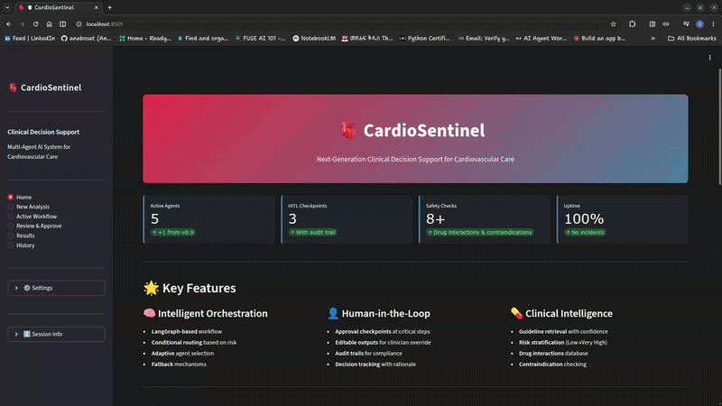

# 🫀 CardioSentinel MAS

**A multi-agent clinical decision support system for cardiovascular disease management.**


> ⚠️ **Research & Demonstration Only.** This system is not intended for clinical use without regulatory approval, clinical validation, and EHR integration.

---



---

## Overview

CardioSentinel MAS is a multi-agent AI system built on **LangGraph graph-based orchestration** and **Mixtral (Groq)**. It coordinates four specialized clinical agents to analyze cardiovascular patient cases, stratify risk, check medication safety, and generate patient-friendly summaries — with clinician approval checkpoints at every critical step.

### At a Glance

| Dimension | Detail |
|-----------|--------|
| **Orchestration** | LangGraph graph with conditional routing |
| **Agents** | 4 specialized (Guideline, Risk, Medication, Patient) |
| **HITL** | 3 approval checkpoints with full audit trail |
| **Error handling** | Retry with exponential backoff + graceful fallbacks |
| **Python** | 3.9+ |

---

## Features

### Graph-Based Orchestration
- Conditional routing based on risk level and medication safety results
- Full workflow state tracked across every node
- Immutable audit trail for compliance and traceability
- Parallel-ready agent architecture

### Human-in-the-Loop (HITL)
- Three approval checkpoints at critical decision points
- Clinicians can approve, modify, or reject agent outputs
- Modifications trigger selective agent re-execution
- All decisions logged with rationale, timestamp, and author


### Clinical Safety
- Drug interaction screening across inferred medications
- Contraindication checking against patient conditions
- Framingham-inspired cardiovascular risk scoring (0–100)
- Evidence-based guideline retrieval via RAG

---

## Architecture

### System Layers

```
┌──────────────────────────────────────────────────┐
│  Streamlit UI                                    │
│  Home · Analysis · Workflow · Review · Results · │
│  History                                         │
└────────────────────┬─────────────────────────────┘
                     │
┌────────────────────▼─────────────────────────────┐
│  LangGraph Orchestration Graph                   │
│  Guideline · Risk · Medication · Patient Agents  │
│  Conditional routing · HITL checkpoints          │
└────────────────────┬─────────────────────────────┘
                     │
┌────────────────────▼─────────────────────────────┐
│  Data Layer                                      │
│  WorkflowState · HumanDecision · AuditEntry      │
└────────────────────┬─────────────────────────────┘
                     │
┌────────────────────▼─────────────────────────────┐
│  Tools                                           │
│  GuidelineRetriever · RiskCalculator             │
│  DrugInteraction · ContraindicationChecker       │
└────────────────────┬─────────────────────────────┘
                     │
┌────────────────────▼─────────────────────────────┐
│  External Services                               │
│  Groq API · RAG Engine               │
└──────────────────────────────────────────────────┘
```

### Workflow Graph

```
START
  ↓
INPUT_VALIDATION
  ↓
GUIDELINE_AGENT ──── Evidence retrieval via RAG
  ↓
RISK_AGENT ────────── Cardiovascular risk scoring
  ↓
[Route: score ≥ 60?] ──YES──→ HUMAN_REVIEW--──┐
  ↓ NO                                        │
MEDICATION_AGENT ─── Drug safety checks       │
  ↓                                           │
[Route: safety issues?] ──YES──→ HUMAN_REVIEW-┘
  ↓ NO                         │
PATIENT_AGENT ◄─────────────── ┘ (on approval)
  ↓
FINALIZE_REPORT
  ↓
END
```

---

## Agents & Tools


### Agents

| Agent | Responsibility | Tool Used |
|-------|---------------|-----------|
| **GuidelineAgent** | Retrieves evidence-based clinical guidelines via RAG | `GuidelineRetrieverTool` |
| **RiskAgent** | Calculates Framingham-inspired cardiovascular risk score (0–100) | `RiskScoreCalculator` |
| **MedicationAgent** | Screens for drug interactions and contraindications | `DrugInteractionTool`, `ContraindicationChecker` |
| **PatientAgent** | Generates plain-language patient summaries using Mixtral | Groq API |

Each agent:
1. Reads relevant fields from `WorkflowState`
2. Executes its tool(s) to produce structured output
3. Catches exceptions and returns safe defaults on failure
4. Appends an `AuditEntry` to the immutable trail
5. Returns the updated state

### Risk Classification

| Score | Classification | Routing |
|-------|---------------|---------|
| 0–30 | 🟢 Low | → Medication check |
| 31–50 | 🟡 Moderate | → Medication check |
| 51–60 | 🟠 High | → Medication check |
| 61–100 | 🔴 Very High | → Human review required |

### Error Handling

All agents implement retry logic with exponential backoff and graceful degradation:

```python
def execute_with_retry(func, max_retries=3, backoff=2.0):
    for attempt in range(1, max_retries + 1):
        try:
            return func()
        except Exception as e:
            if attempt < max_retries:
                time.sleep(backoff ** (attempt - 1))
            else:
                raise
```

If an agent fails after all retries, it returns an empty default output, logs the error to the audit trail, and the workflow continues.

---

## Human-in-the-Loop Workflow

### Approval Checkpoints

**Checkpoint 1 — Medication Safety (Critical)**
- Triggers when any drug interactions or contraindications are detected
- Clinician reviews: severity, affected medications, recommended alternatives

**Checkpoint 2 — Risk Stratification**
- Triggers when cardiovascular risk score ≥ 60
- Clinician reviews: score breakdown, contributing factors, classification

**Checkpoint 3 — Clinical Guidelines**
- Triggers on manual review request
- Clinician reviews: recommendations, evidence sources, confidence levels


### Decision Actions

At each checkpoint, the clinician chooses one of:

| Decision | Effect |
|----------|--------|
| ✅ **Approve** | Workflow proceeds to next agent |
| ⚙️ **Modify** | Edit intermediate data, re-run affected agents |
| ❌ **Reject** | Workflow halts; full state returned with rejection reason |

---

## Quick Start

### 1. Install dependencies

```bash
cd cardiosentinel_mas
python -m venv venv
source venv/bin/activate        # Windows: venv\Scripts\activate
pip install -r requirements.txt
```

### 2. Configure your API key

```bash
cp .env.example .env
# Open .env and set GROQ_API_KEY=sk-ant-...
```

### 3. Launch the UI

```bash
streamlit run app.py
# Opens at http://localhost:8501
```

### 4. Or run the CLI

```bash
python main_new.py
```

### Programmatic usage

```python
from core.graph import run_workflow

patient_data = {
    "age": 65,
    "bp": "150/95",
    "ldl": 160,
    "conditions": ["hypertension", "smoking"],
}

state = run_workflow(patient_data, "What is the first-line therapy?")

print(f"Risk score:    {state.risk.score}/100")
print(f"Risk class:    {state.risk.classification}")
print(f"Guidelines:    {state.guidelines.recommendations}")
print(f"Medication OK: {state.medication_safety.safe_to_proceed}")
```

### Worked example

**Patient**: 65-year-old male, hypertension, LDL 160, active smoker
**Query**: *"What is first-line therapy?"*

```
1. Input validation          ✓ Schema valid
2. Guideline Agent           3 recommendations retrieved (high confidence)
3. Risk Agent                Score: 65/100 → Very High
4. Routing                   Score ≥ 60 → Human Review
5. Human Review              ⏸ Clinician approves with notes
6. Medication Agent          0 interactions · 0 contraindications → SAFE
7. Patient Agent             Plain-language summary + lifestyle advice
8. Finalize Report           Audit trail complete
9. Export                    PDF / case history saved
```

---

## Configuration

### Environment variables (`.env`)

```bash
GROQ_API_KEY=sk-ant-........   # Required — GROQ API key
LOG_LEVEL=INFO                 # DEBUG | INFO | WARNING | ERROR
UI_THEME=dark                  # light | dark | auto
```

---

## Project Structure

```
cardiosentinel_mas/
│
├── app.py                        # Streamlit entry point
├── main_new.py                   # CLI entry point
├── config.py                     # Constants and configuration
│
├── core/                         # Orchestration
│   ├── base.py                   # BaseTool, BaseAgent (retry, fallback)
│   ├── graph.py                  # LangGraph workflow definition
│   ├── node_definitions.py       # Agent node implementations
│   └── edge_routing.py           # Conditional routing functions
│
├── agents/                       # Specialized agents
│   ├── guideline_agent.py
│   ├── risk_agent.py
│   ├── medication_agent.py
│   └── patient_agent.py
│
├── tools/                        # Tool implementations
│   ├── rag_tool.py
│   ├── risk_tool.py
│   ├── interaction_tool.py
│   └── contraindication_tool.py
│
├── schemas/                      # Data models
│   ├── outputs.py                # Per-agent output schemas
│   └── state.py                  # WorkflowState, HumanDecision, AuditEntry
│
├── hitl/                         # Human-in-the-loop
│   └── approval_manager.py       # ApprovalManager, AuditLogger
│
├── ui/                           # Streamlit UI
│   ├── app.py
│   ├── components/
│   │   └── components.py         # Reusable UI components
│   └── styles/
│       └── theme.py              # Cardiovascular theme (300+ CSS rules)
├── pages/
│   ├── home.py
│   ├── new_analysis.py
│   ├── workflow.py
│   ├── review.py
│   ├── results.py
│   └── history.py
│
├── tests/
│   ├── test_agents.py
│   ├── test_tools.py
│   ├── test_pipeline.py
│   └── conftest.py
│
├── requirements.txt
├── .env.example
└── .streamlit/config.toml
```

---

## 🛠 Tech Stack


### Core


### Testing & Deployment


### Validation & Data


### AI & LLMs


---

## Extending the System

### Adding an agent

1. Create a class in `agents/` inheriting from `BaseAgent`
2. Implement `run(state: WorkflowState) -> WorkflowState`
3. Register it as a node in `core/graph.py`
4. Define routing from and to the new node in `core/edge_routing.py`

### Adding a tool

1. Create a class in `tools/` inheriting from `BaseTool`
2. Implement `run(**kwargs) -> Dict`
3. Register the tool in the relevant agent

### Custom routing logic

1. Add a routing function in `core/edge_routing.py`:
   ```python
   def route_after_my_agent(state: WorkflowState) -> str:
       if some_condition(state):
           return "human_review"
       return "next_agent"
   ```
2. Wire it in `core/graph.py` with `add_conditional_edges`

### Performance notes

| Operation | Typical duration |
|-----------|----------------|
| Input validation | < 100 ms |
| Guideline agent | 1–2 s |
| Risk agent | < 100 ms |
| Medication agent | < 100 ms |
| Patient agent | 1–2 s |
| **Total (no review)** | **2–5 s** |

Optimization paths: LRU caching for RAG queries and risk calculations, parallelizing independent agents, early exit routing.

---

## Deployment

### Docker

```dockerfile
FROM python:3.11-slim
WORKDIR /app
COPY . .
RUN pip install -r requirements.txt
EXPOSE 8501
CMD ["streamlit", "run", "app.py"]
```

```bash
docker build -t cardiosentinel .
docker run -p 8501:8501 -e GROQ_API_KEY=sk-ant-... cardiosentinel
```

---


## Security & Compliance

- Immutable audit trail with decision rationale and authorship
- Human approval required at every clinically significant routing decision
- Data isolation per session; no cross-session state leakage

---

## Disclaimer

This is a **demonstration system for research purposes only**. It must not be used to inform real patient care without:

- Integration with certified EHR systems and real clinical data sources
- Clinical validation studies
- Regulatory approval (FDA, CE marking, or equivalent)
- Professional liability insurance

---

*Built by a passionate AI Engineer and Pharmacy Student*